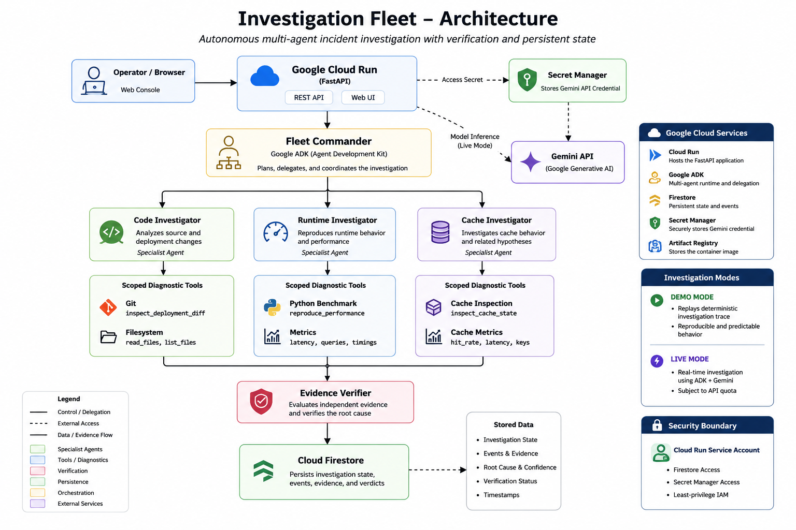

# Investigation Fleet

## Governed Multi-Agent Incident Investigation

Investigation Fleet is a multi-agent incident investigation platform that
delegates operational investigation tasks to specialized agents, executes
scoped diagnostic tools, collects evidence, and verifies the final root cause.

---

# The Problem

Operational incidents often require several different kinds of investigation.

For example, a latency regression may require:

- deployment and source inspection
- runtime reproduction
- database analysis
- cache analysis
- evidence comparison

A conventional workflow makes one engineer manually coordinate these steps.

Investigation Fleet turns that workflow into an autonomous investigation process.

```text
Incident
   |
   v
Fleet Commander
   |
   +----> Code Investigator
   |
   +----> Runtime Investigator
   |
   +----> Cache Investigator
   |
   v
Evidence Verifier
   |
   v
Root Cause


---

#  Demonstrated Incident

This is the section you were asking about.

Immediately after `The Problem`, paste:

```markdown
---

# Demonstrated Incident

## Checkout API Latency Regression

The benchmark incident is a checkout API whose p95 latency increased after
the latest deployment.

```text
180 ms → 1700 ms

---

# What Makes This an Investigation Fleet?

The system is intentionally designed as a fleet of specialized agents instead
of one unrestricted general-purpose agent.

```text
                    +-------------------+
                    |  Fleet Commander  |
                    +---------+---------+
                              |
              +---------------+---------------+
              |               |               |
              v               v               v
       +-------------+  +-------------+  +-------------+
       |    Code     |  |   Runtime   |  |    Cache    |
       | Investigator|  | Investigator|  | Investigator|
       +------+------+  +------+------+  +-------------+
              |               |
              v               v
             Git        Python benchmark
              |               |
              +-------+-------+
                      |
                      v
              +---------------+
              | Evidence      |
              | Verifier      |
              +-------+-------+
                      |
                      v
                 Firestore


---


# How the Fleet Works

A typical investigation follows this sequence:

```text
1. Incident received
        |
        v
2. Fleet Commander evaluates the incident
        |
        v
3. Commander delegates work to a specialist
        |
        v
4. Specialist executes a scoped diagnostic tool
        |
        v
5. Tool produces evidence
        |
        v
6. Evidence is persisted
        |
        v
7. Additional investigation is performed
        |
        v
8. Independent evidence is collected
        |
        v
9. Evidence Verifier evaluates the evidence
        |
        v
10. Root cause is verified


---


# Core Components


## Fleet Commander

The Commander is the orchestration layer.

Its responsibility is to coordinate the investigation and delegate work to the
specialist agents.

---

## Code Investigator

The Code Investigator focuses on source and deployment changes.
Example diagnostic:

```text
inspect_deployment_diff

For the demonstrated incident it discovers the change from a batched query
to a per-item query.


## Runtime Investigator

The Runtime Investigator focuses on reproducing observed behavior.

Example diagnostic:
```text
reproduce_performance
For the demonstrated incident it observes:
```text
1 query → 47 queries

along with the measured latency regression.

---

Cache Investigator

The Cache Investigator is a specialized capability for incidents where cache
behavior is suspected.

It is part of the fleet architecture even when it is not required for the
demonstrated incident.


---

# Evidence and Verification

The system separates:

```text
Observation
    |
    v
Evidence
    |
    v
Verification
    |
    v
Conclusion

---

# Google Cloud Architecture



The system separates orchestration, specialist investigation, diagnostic
tool execution, evidence verification, and persistent state into distinct
components.

The hosted service runs on Google Cloud.

```text
                         Operator
                            |
                            v
                  +----------------------+
                  |      Cloud Run       |
                  |       FastAPI        |
                  +----------+-----------+
                             |
                             v
                  +----------------------+
                  |   Fleet Commander    |
                  |      Google ADK      |
                  +----------+-----------+
                             |
               +-------------+-------------+
               |             |             |
               v             v             v
        Code Investigator  Runtime       Cache
               |          Investigator  Investigator
               v             |
              Git       Python benchmark
               |             |
               +------+------+
                      |
                      v
             +--------------------+
             | Evidence Verifier  |
             +---------+----------+
                       |
                       v
                 +-----------+
                 | Firestore |
                 +-----------+

Secret Manager
      |
      +----> Gemini API credential


---


# Persistent Investigation State

Investigation state is persisted separately from the application process.

An investigation record contains information such as:

```text
investigation_id
case_id
status
mode
events
root_cause
confidence
root_cause_verified
updated_at


---

# Demo Mode

The hosted demonstration uses:

```text
mode = demo

---

# API

## Health

```http
GET /health

---

# Repository Structure

```text
autonomous-investigation-engine/
│
├── benchmark/
│   ├── cases/
│   │   └── api_latency_regression.json
│   │
│   └── demo/
│       └── api_latency_fleet_trace.json
│
├── docs/
│   ├── architecture.md
│   └── architecture.mmd
│
├── investigator/
│   ├── api/
│   │   ├── app.py
│   │   └── static/
│   │       └── index.html
│   │
│   ├── domain/
│   ├── evaluation/
│   ├── execution/
│   ├── fleet/
│   ├── investigation/
│   ├── planning/
│   ├── reasoning/
│   └── tools/
│
├── scripts/
├── tests/
│
├── Dockerfile
├── Procfile
├── requirements.txt
└── README.md


---

# Testing

The test suite covers:

- agent registry
- fleet orchestration
- scoped diagnostic tools
- Git investigation
- runtime investigation
- benchmark evaluation
- API behavior
- Firestore state
- reasoning schemas
- investigation workflow

Run:

```powershell
pytest


---

# Hosted Deployment

The current Cloud Run service is:

```text
https://investigation-fleet-972092482037.asia-south1.run.app


---

# Security

Sensitive credentials are not stored in source code.

The Gemini API credential is stored in:

```text
Google Secret Manager


---

# Design Principles

## Specialized Agents

Use specialist agents instead of one unrestricted agent.

## Scoped Tools

Give each specialist only the tools required for its role.

## Evidence First

Prefer concrete diagnostic observations over unsupported assumptions.

## Independent Verification

Separate evidence collection from final verification.

## Persistent State

Store investigation state independently from the process executing the
investigation.

## Reproducibility

Benchmark and replay capabilities make investigations reproducible.


---

# Why This Matters

Investigation Fleet moves incident response from:

```text
Human
  |
  v
manually inspect everything
  |
  v
manually coordinate tools
  |
  v
manually correlate evidence
  |
  v
manually decide root cause


---

# Future Production Extensions

The current implementation is optimized for the hackathon demonstration.

A production deployment could extend the system with:

- durable asynchronous job execution
- Cloud Tasks or Pub/Sub
- stronger authentication and authorization
- richer observability
- additional incident types
- more diagnostic integrations
- policy enforcement
- human approval gates for sensitive actions


---

# Demo

The intended demonstration flow is:

```text
Open hosted application
        |
        v
Start investigation
        |
        v
Fleet Commander
        |
        v
Code Investigator
        |
        v
Git evidence
        |
        v
Runtime Investigator
        |
        v
Runtime evidence
        |
        v
Evidence Verifier
        |
        v
ROOT CAUSE VERIFIED


---


# Project Status

```text
Core investigation engine      ✅
Multi-agent fleet              ✅
Google ADK                     ✅
Specialist agents              ✅
Scoped diagnostic tools        ✅
Benchmark suite                ✅
Evidence verification          ✅
Firestore persistence          ✅
Cloud Run deployment           ✅
Secret Manager                 ✅
Hosted web console             ✅
Reproducible demo mode         ✅
Automated tests                ✅